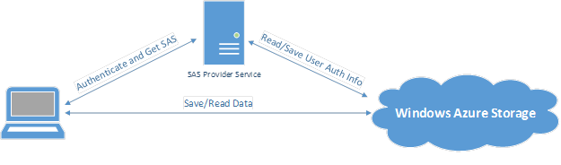
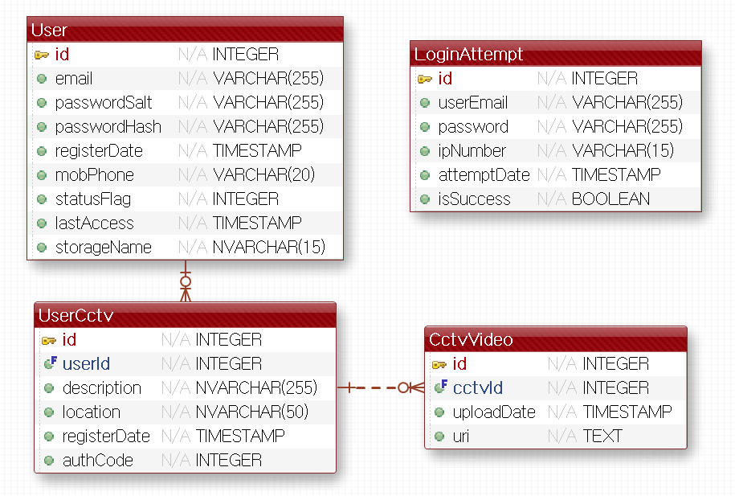

# OwlAPI &nbsp;

### Overview
##### OwlAPI는 Java로 쓰였으며 Spring MVC Framework를 통해 구현되었다   주로 CCTV에서 움직임이 검출되어 녹화된 영상을 저장하고 회원가입, 사용자 인증 그리고 SAS 토큰 발행 기능을 수행한다

### Fetures
- jwt 토큰을 사용하여 사용자 인증 (Stateless)
- Azure Storage에 파일 및 기타 리소스를 저장하며 각 회원에게 SAS 토큰을 발급해 접근권한을 부여한다
  
&nbsp;
- Restful API 구조
- Mybatis 연동
- Mysql DB 사용

### Architecture

### Database
&nbsp;
